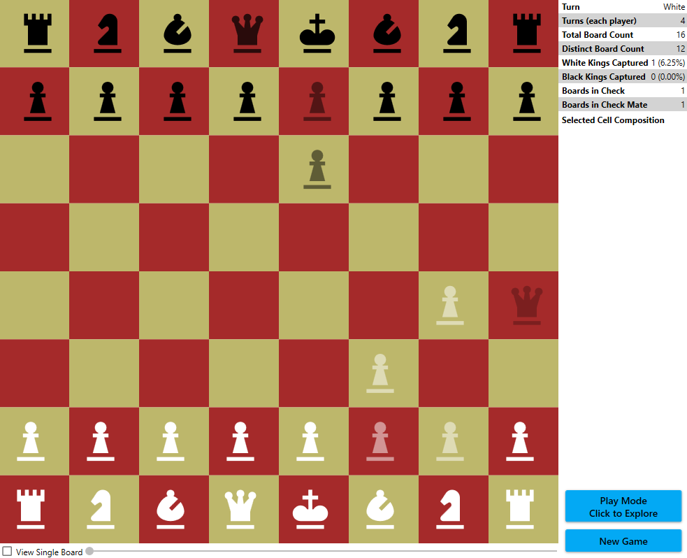

# QuantumChess

A WPF variation of [Quantum Chess](https://quantumchess.net/).

This was really more of an experiment to see how well a computer could handle tracking the explosion of quantum states of pieces as the game progresses.  So far, I've applied random plays up to around 23, and I didn't see any degradation of CPU performance, and it only used around 130 MB of memory.  I think it handles pretty well.

The [average game of normal chess by humans is about 40 moves](https://chess.stackexchange.com/a/2507), where a move is counted as a play by white then a play by black.  (There's a specific name for what I'm calling a "play," but I can't be bothered to look it up right now.)  That would be 80 plays, so I'm only about a quarter of the way there... or however that works out with quantum expansion.

## How it works

The idea of the game is pretty simple, but it gets really complex really quickly.

1. The rules of normal chess apply... for each individual board.
1. To make a move, a player selects the source square and a target square.  If there is at least one playable board where a move is possible between the two squares, the move is applied.
1. The game then generates two cases: one where the move is applied and one where it isn't, both at a 50% chance.  To apply a move to a board, the game will make a copy of the board, apply the move to the copy, and add the altered copy to the playable set.  If the move is not valid for a board, an unaltered copy of that board is added (internally a duplication counter is incremented).
1. When a king is captured (or put in checkmate), that board is no longer playable (but it's still rendered).
1. When any other piece is captured, it is no longer rendered _for the boards where it's still there_.

## An example

We start with a new board.  It looks pretty standard.

White makes a move.

> You can see both boards simultaneously.  When you select a cell, you can see the pieces present in that cell along with the probability that the piece is there (see [UI](#the-ui)).  The probability of a piece's presence is graphically indicated by its opacity.

Black makes a move.

> Just like with white's move, there is now a 50% chance of the piece appearing in two different squares.
> 
> At this point we have four boards, all with 25% probability:
> 
> 1. No one moved.
> 1. Only white moved.
> 1. Only black moved.
> 1. Both moved.

Now white moves, and captures the black pawn.

> Now it starts getting complex.  Only one of the four boards is in a state where this move is valid, so:
> 
> 1. The three boards where the move is invalid are "copied" (duplication counter is incremented).
> 1. The board where the move is valid is also copied, and the move is applied in the copy, leaving the original intact.  The altered copy is then added to the board space.
>
> Now we have eight boards, but three of them are exact duplicates of three others.  We can ignore those, which gives us five _distinct_ boards:
> 
> 1. No one moved. (25%)
> 1. Only white moved. (25%)
> 1. Only black moved. (25%)
> 1. Both moved, but white didn't capture black. (12.5%)
> 1. White captured black. (12.5%)
> 
> This also yields individual probabilities on the pieces in the "capture" square:
> 
> 1. Black pawn at 37.5%
> 1. White pawn at 12.5%
>
> This is because there _was_ a 50% chance the black pawn was there, but it was captured by the white pawn with a 12.5% chance.

## The UI

The play area takes up the majority of the screen.

In the upper right, are various stats:

- **Turn** - Which player goes next.
- **Turns** - How many "plays" have been made (white + black).
- **Total Board Count** - The total number of boards.  This will always be `2^[Turns]` because each turn generates a no-op and a move.
- **Distinct Board Count** - Some of the boards may be exact duplicates of others.  This tracks how many disctinct boards there are.
- **White Kings Captured** - How many boards have a white king in checkmate (black win count).
- **Black Kings Captured** - How many boards have a black king in checkmate (white win count).
- **Boards in Check** - How many boards have either king in check, but not in mate.
- **Boards in Checkmate** - How many boards have either king in checkmate.  This will be the sum of the kings captured.
- **Selected Cell Composition** - When selecting a cell, this will list out the unique pieces and their probabilities of being in that cell.

In the bottom right are some commands.

- **Play/Explore Mode** - Toggles between playing and exploring.  Explore mode allows you to select cells without being able to move any pieces.  This is useful when studying the board.  The game starts in play mode.
- **New Game** - Resets the board space for a new game.

At the bottom is a checkbox which enables a slider.  This slider will allow you to view all of the distinct boards individually without the transparency/overlay effect.  The slider can also be navigated with the left and right arrow keys.

The screen shot above is the [Fool's Mate](https://en.wikipedia.org/wiki/Fool%27s_mate).  Only one of the 16 boards results in a checkmate; another one is in a simple check (because the black queen can still be blocked by the white pawn); and the rest are just in-progress games.

## Some other notes

Thanks to @Kairus101 for inspiring this project and helping work out details of how the game should work.

I feel that this app properly models the quantum nature of the game.  We had explored the idea of just maintaining and calculating probabilities, but we determined that there are cases where this wouldn't suffice.

Suppose we have in our board space a board that has a white pawn at **C4** at a 25% probability and a black rook at **C1** also at a 25% probability.  We want to move the rook to **C5**.  If we just look at probabilities, then there's a 6.25% probability that the move will be blocked (25% of 25%).  But in the _actual_ quantum board space, the rook's 25% and the pawn's 25% may be completely disjoint.  This would mean that there's a 100% chance that the rook would move _in the boards that had the rook there_ because there's no board where the rook would be blocked.  This kind of scenario can't be modeled with mere probabilities, so we have to track each board.
