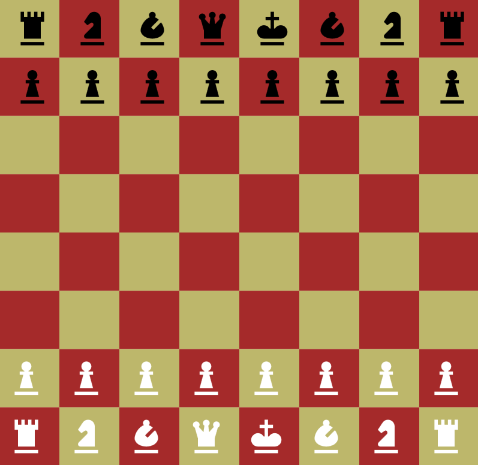
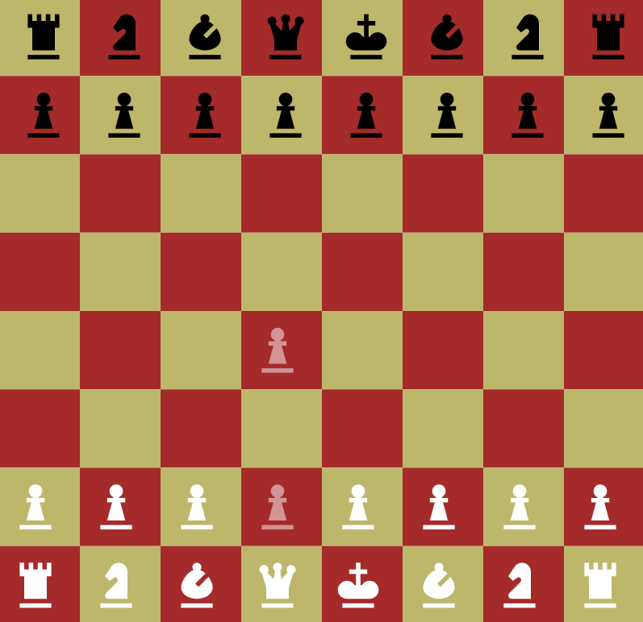
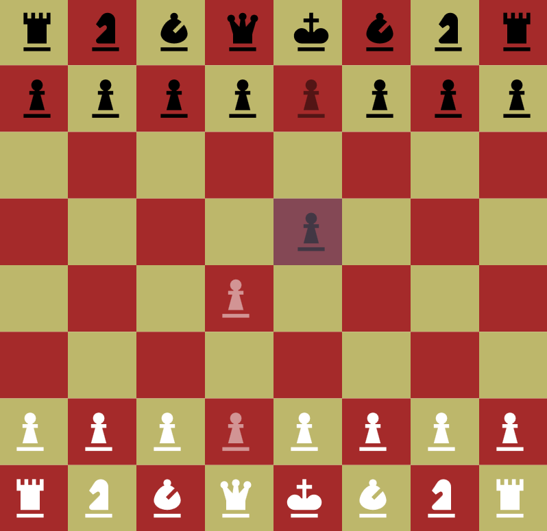
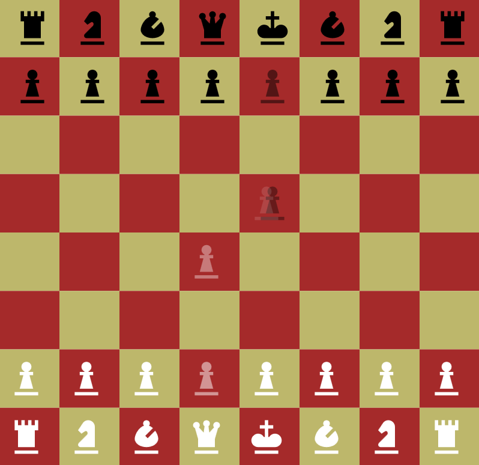

# QuantumChess

A WPF variation of [Quantum Chess](https://quantumchess.net/).

## How it works

The idea of the game is pretty simple, but it gets really complex really quickly.

1. The rules of normal chess apply... for each individual board.
1. To make a move, a player selects the source square and a target square.  If there is at least one playable board where a move is possible between the two squares, the move is applied.
1. The game then generates two cases: one where the move is applied and one where it isn't, both at a 50% chance.  To apply a move to a board, the game will make a copy of the board, apply the move to the copy, and add the altered copy to the playable set.  If the move is not valid, an "unaltered copy" of the board is added (internally a duplication counter is incremented).
1. When a king is captured, that board is no longer playable (but it's still rendered).
1. When any other piece is captured, it is no longer rendered _for the boards where it's still there_.

## An example

We start with a new board.  It looks pretty standard.

White makes a move.

> You can see both boards simultaneously.  When you select a cell, you can see the pieces present in that cell along with the probability that the piece is there.  The probability of a piece's presence is indicated by its opacity.

Black makes a move.

> Just like with white's move, there is now a 50% chance of the piece appearing in two different squares.
> 
> At this point we have four boards, all with 25% probability:
> 
> 1. No one moved.
> 1. Only white moved.
> 1. Only black moved.
> 1. Both moved.

Now white moves, and captures the black pawn.

> Now it starts getting complex.  There's only one of the four boards where this move is valid, so:
> 
> 1. The three boards where the move is invalid are "copied" (duplication counter is incremented).
> 1. The board where the move is valid is also copied, and the move is applied in the copy.
>
> Now we have eight boards, but three of them are exact duplicates of three others.  We can ignore those, which gives us five _distinct_ boards:
> 
> 1. No one moved. (25%)
> 1. Only white moved. (25%)
> 1. Only black moved. (25%)
> 1. Both moved. (12.5%)
> 1. White captured black. (12.5%)
> 
> This also yields individual probabilities on the pieces in the "capture" square:
> 
> 1. Black pawn at 37.5%
> 1. White pawn at 12.5%
>
> This is because there _was_ a 50% chance the black pawn was there, but with a 12.5% chance, it was captured by the white pawn.

## Some other notes

I feel that this app properly models the quantum nature of the game.  We had explored the idea of just maintaining and calculating probabilities, but we determined that there are cases where this wouldn't suffice.

Suppose we have in our board space a board that has a white pawn at **C4** at a 25% probability and a black rook at **C1** also at a 25% probability.  We want to move the rook to **C5**.  If we just look at probabilities, then there's a 6.25% probability that the move can be made.  But in the _actual_ quantum board space, the rook's 25% and the pawns 25% may be completely disjoint.  This would mean that there's a 100% chance that the rook would move _in the boards that had the rook there_ because there's no board where the rook would be blocked.  This can't be modeled with mere probabilities, so we have to track each board.

Thanks to @Kairus101 for inspiring this project and helping work out details of how the game should work.